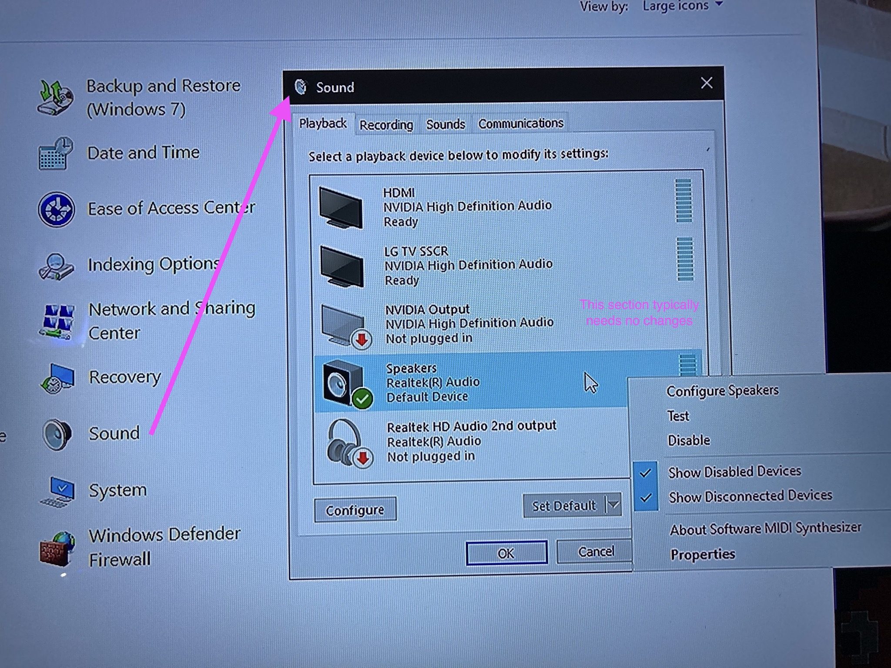
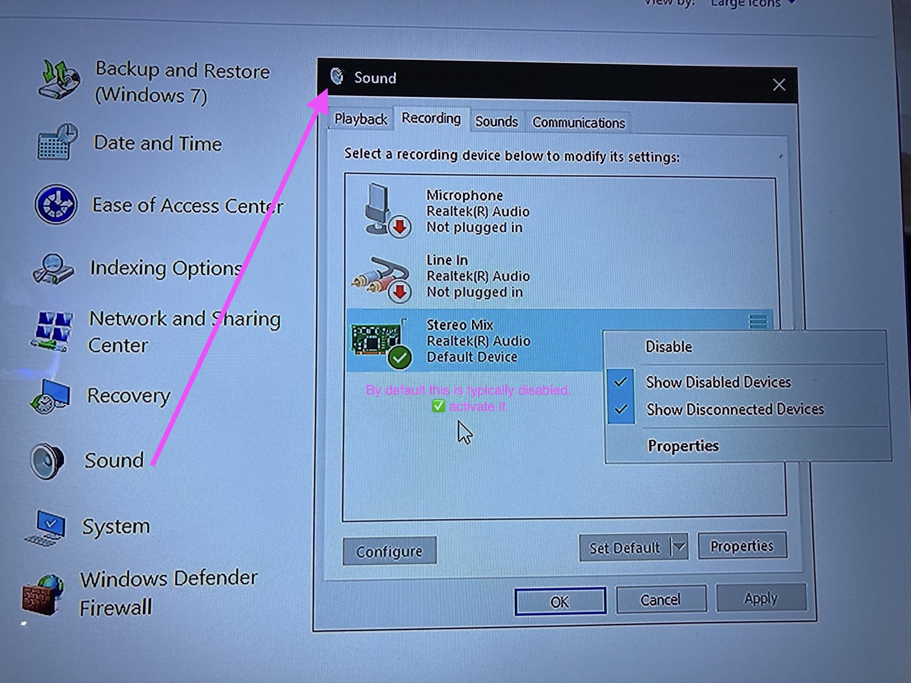
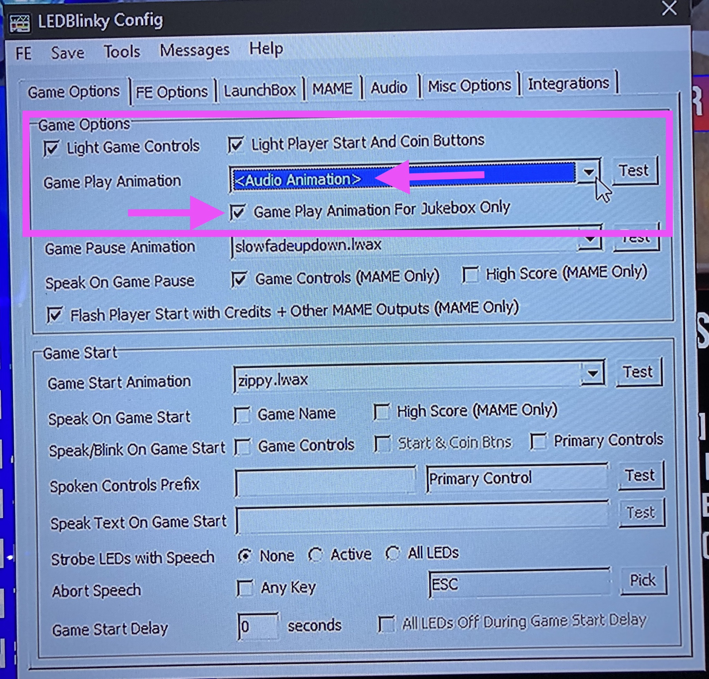
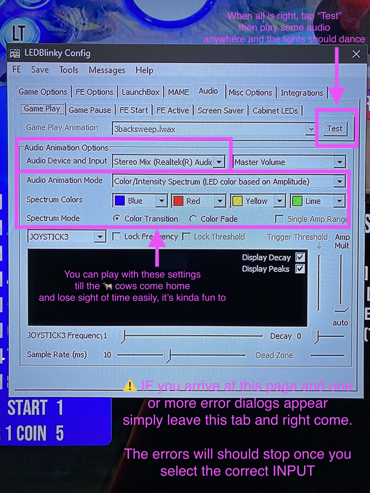
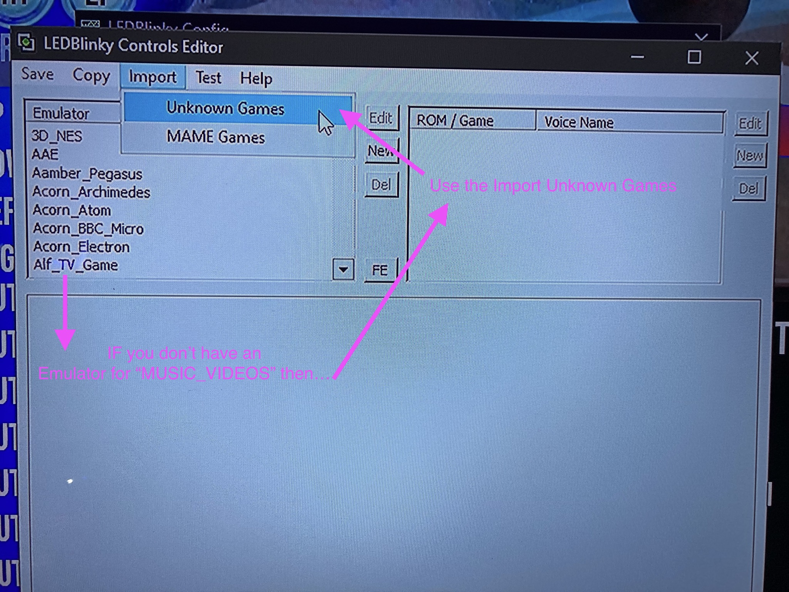
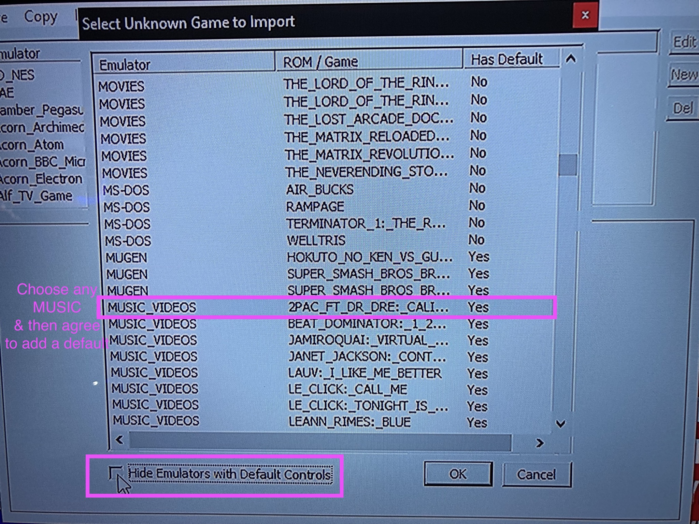
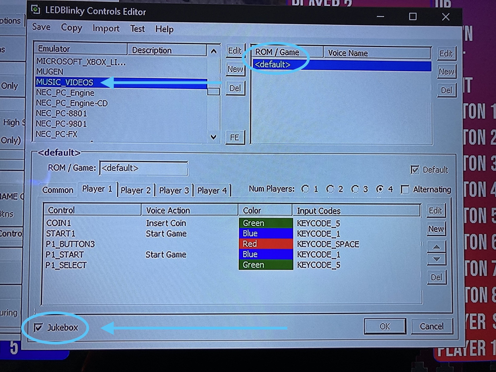
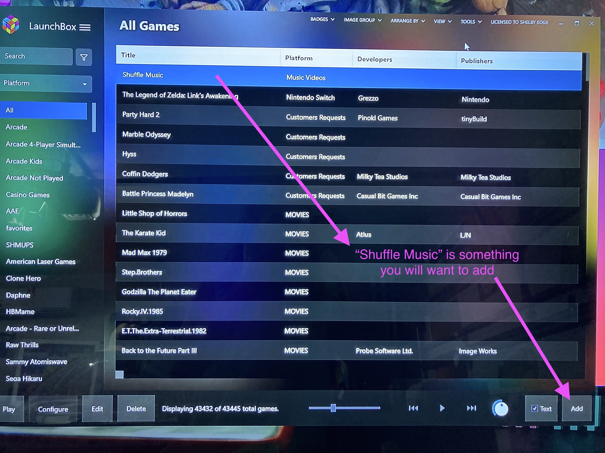
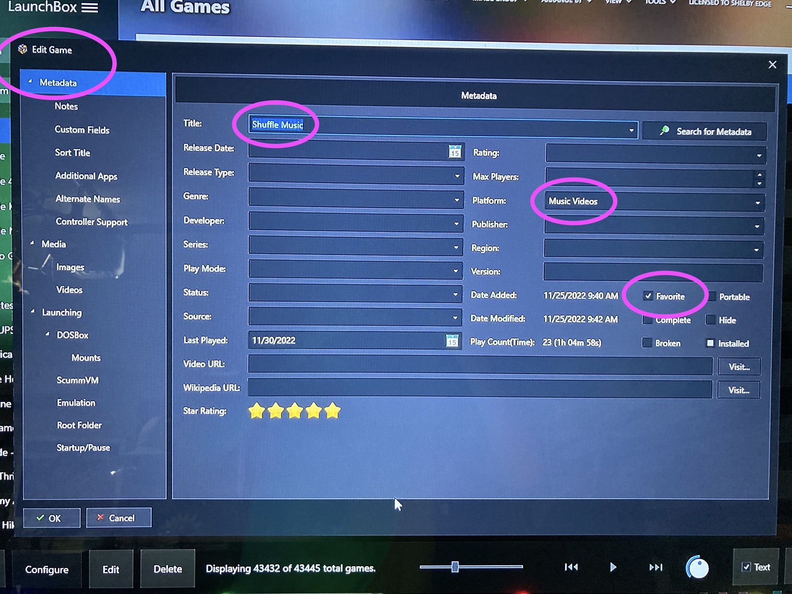
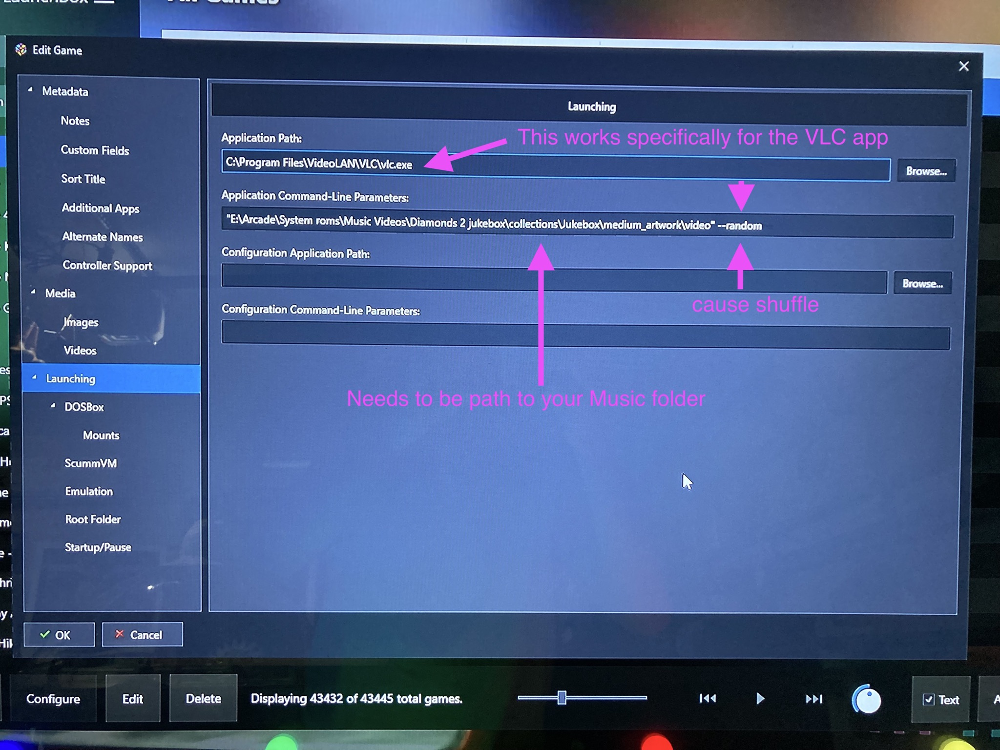

# 💪 Enhancements

- [☸️ Make BigBox wheel stop fading out](#-make-bigbox-wheel-stop-fading-out)
- [💥 LaunchBox to startup into a specific game](#-launchbox-to-startup-into-a-specific-game)
- [🚦 🕺 LEDBlinky dance lights to music](#-ledblinky-dance-lights-to-music)

## ☸️ Make BigBox wheel stop fading out

CASE: You or your first time guests can't tell when they are in a menu or in a game. It's just confusing when the selection wheel is not shown. When I first got my Megacade I thought the menu was trash because of this, it's not. Let's fix it below

Note: This documentation is exact for my Omega Megacade made in August 2022. Overtime the exact files documented below may change but the concept to apply fix remains the same.

**Platform Wheel no fade**
1. Find the file related to the platform wheel fading out
    - `PlatformWheel2FiltersView.xaml`
    - 📁 my machine parent folder is: `C:\Users\Administrator\LaunchBox\Themes\Unified Redux\Views`
2. Open/edit the file in any text editor
    - 🔎 search for `<!-- FADING WHEEL -->` or just `FADING WHEEL`
3. Edit the last `<EasingDoubleKeyFrame` where you see `Value="0"`
    - Set to `Value="1"` and the wheel will not fade
    - Pro tip: Instead set to `Value="0.5"` and the wheel will half fade (kinda nice)
4. 💾 save and close and test Big Box platform wheel

**Game Wheel no fade**
1. Find the file related to the platform wheel fading out
    - `Wheel4GamesView.xaml`
    - my machine the parent folder is: `C:\Users\Administrator\LaunchBox\Themes\Unified Redux\Views`
2. Open/edit the file in any text editor
    - 🔎 search for `<!-- FADING WHEEL -->` or just `FADING WHEEL`
3. Edit the last `<EasingDoubleKeyFrame` where you see `Value="0"`
    - Set to `Value="1"` and the wheel will not fade
    - Pro tip: Instead set to `Value="0.2"` and the wheel will fade enough to let videos play through but still indicate you are at the menu (kinda nice)
4. 💾 save and close and test Big Box platform wheel

> The following two links help me figure out the wheel fade:
> [link 1](https://forums.launchbox-app.com/topic/44719-show-game-wheel-permanently/) and [link 2](https://forums.launchbox-app.com/topic/44049-unified/page/7/#comment-281260)

### 💥 LaunchBox to startup into a specific game

Use cases:
- At my house, guests can turn on Megacade and get right into a game without learning menus
- You want the art package on megacade to match power on game
- You want the startup process to have a few workflows
  - You want the matching marquee to show to show with startup game
  - You have light up buttons and/or joysticks and want them to match the startup game
  - exiting game goes back into Launchbox

This process revolves around using a super great [Launchbox plugin](https://forums.launchbox-app.com/files/file/3267-big-box-auto-play/)

## 🚦 🕺 LEDBlinky dance lights to music

Documentation tailored for [EHA](https://extremehomearcades.com/home.aspx) but fairly applicable to anyone using LEDBlinky and wanting to have lights dance with the sound of music

🧠 **Recommended knowledge**
- Should know way around LEDBlinky apps
- Should be able to locate folder containing music videos
- Should be ok with altering Windows sound device settings

**Summary of steps to be performed**
1. 🔊 Windows sound playback
2. 🎤 Windows sound recording
3. 👾 LEDBlinky game options
4. 🚦 🔊 LEDBlinky audio options
5. 👾 🚦 Add LEDBlinky music videos emulator
6. 🚦 🕺 LEDBlinky music videos controls
7. 🔀 Launchbox add "Shuffle Music"
8. ⌨️ VLC quick keys

### Details steps

1. 🔊 **Windows sound playback**
    - Goto Windows control panel and open "Sound"
    - Compare your configuration with the following screen shot, however machines are sure to be different so goal is to ensure and make note of what device does sound playback 
    

2. 🎤 **Windows sound recording**
    - In the same relative area as the previous step, goto the tab "Recording"
    - Ensure you have an enable device that typically matches in name to your sound playback device
    - Once enabled, you can test playing audio somewhere and you should visually see confirmation audio communicates to your Windows 
    

3. 👾 **LEDBlinky game options**
    - Open `LEDBlinky config` app
    - The Game Options tab should be highlighted
    - Ensure "Game Play Animation" has value of `<Audio Animation>` selected
    - Recommended to select "Game Play Animation for Jukebox Only 
    

4. 🚦 🔊 **LEDBlinky audio options**
    - Goto the Audio tab of `LEDBlinky Config`
    - ⚠️ It's possible an **error maybe thrown** when you land on this page
        - You may need to leave this tab and come back **twice**
        - Once the error has settled, immediately attempt to use the "Audio Device and Input" dropdown
        - You should select the value that closely matches your Windows sound recording device
        - The previous error, going forward, show no longer occur if you have performed previous Windows sound steps AND you selected the correct device 
    - All other settings alter the behavior of the lights and are not as important at this time
    - Use the "Test" button WHILE some audio is playing through your Windows recording sound device and you should see your lights dance 
    

5. 👾 🚦 **Add LEDBlinky music videos emulator**
    - Let's ensure LEDBlinky knows when it should start dancing lights
    - Open the `LEDBlinky Controls Editor` tool
    - You will need to ensure you have an "Emulator" with name relatively as "MUSIC_VIDEOS" that has a `<default>` ROM/Game
    - Select the Import `Unknown Games` menu item
    - Find an Emulator with title `MUSIC_VIDEOS`
    - Tap "OK" and if prompt appears about adding a default, do so 
    
    

6. 🚦 🕺 **LEDBlinky music videos controls**
    - Edit the `MUSIC_VIDEOS <default>` emulator
    - 👉 👉 Ensure `☑️ Jukebox` checkbox is checked 👈 👈
    - All other settings will force certain lights NOT to dance but instead maintain a specific color
    - Recommend Player 1 Button 3 maintain red for stop/play toggle
    - In a later step, documented below, additional button light recommendations will be made and you will color them here 
    

7. 🔀 Launchbox add "Shuffle Music"
    - Let's add a new game into LaunchBox so we can have one **favorite** item that will shuffle music
    - Open LaunchBox, not BigBox, and tap the "Add" button
    - Fill out the metadata and ensure to check "☑️ Favorite"
    - Goto "Launching" tab
      - Fill out where the VLC.exe app lives
      - TIP: Review screen shot(s) below or find a rom in LaunchBox that already loads audio and compare file paths
      - Fill out the command line parameters to indicate where your folder of all music videos are AND to add the `--random` flag that will shuffle the music. 
    
    
    

8. ⌨️ VLC quick keys
    - Within the VLC app, it's recommend to edit the hotkey settings
    - Set Player 1 start to "previous"
    - Set Player 1 coin to "next"
    - Recommend coloring in LEDBlinky, any hotkeys such as blue for "back" and green for "next"