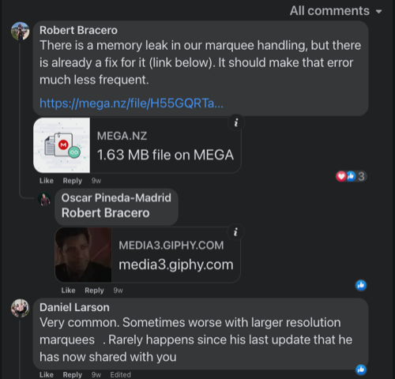
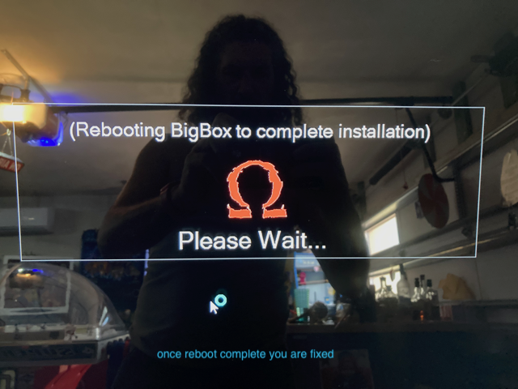

# ✅ Fixed issues

**Table of contents**
- [🕹 Diagonals not working](#-diagonals-not-working)
- [🦜 TeknoParrot fails to open game](#-teknoparrot-fails-to-open-game)
- [🔀 Change default emulator used](#-change-default-emulator-used)
- [⠇ Menus and side effect during game play](#-menus-and-side-effect-during-game-play)
- [🏃 Game plays too fast](#-game-plays-too-fast)
- [🕹 XArcade XInput no player one](#-xarcade-xinput-no-player-one)
- [Atari 5200 blue screen](#atari-5200-blue-screen)
- [🧠 Fix attract mode out of memory issue](#-fix-attract-mode-out-of-memory-issue)
- [💡 Fix skipped lights during attract mode](#-fix-skipped-lights-during-attract-mode)

## 🕹 Diagonals not working

If your players are not allowing Diagonals, open the panel and move the restrictor plates (round dials that turn with 4 spring loaded screws). They are normally all set to 8-way for the 4 players normal joysticks but they may be turned to 4-way for some reason.

[j-stick-ball-top](https://www.ultimarc.com/arcade-controls/joysticks/j-stik-ball-top/)

### 🦜 TeknoParrot fails to open game

Most likely the issue is that your Visuall C++ needs updating

1. Download the microsoft [zip file here](https://www.techpowerup.com/download/visual-c-redistributable-runtime-package-all-in-one/)
2. Unzip the downloaded file somewhere onto your arcade machine
3. To install, run the included install-all.bat with admin privileges
    - right click, "Run as administrator"
4. Restart and enjoy

### 🔀 Change default emulator used

CASE: The default Nintendo 64 emulator does not show any side bezel art. If you just switch the default emulator then every N64 game will look better when opened

> 5 screen captures of this process below

1. Open Launchbox app (not the BigBox main app)
2. Goto 🛠 tools > manage emulators > retroarch > cores
3. Set what you want as default
  - Be very careful. You can break many systems messing around in there.

### ⠇ Menus and side effect during game play

Most emulators have hotkeys. To fix odd menus and action from occurring, change or turn off hot keys in the appropriate emulator's application settings.

### 🏃 Game plays too fast

1. Goto Nvidia Control Panel app
2. Manage 3D settings
3. Program settins tab
4. Add the exe or whatever opens the game
    - If you recently opened, just use the "Recently used" category and find application
5. then Max Frame Rate, typically to 60
    - I could not type in the field, I choose 58 as only value I could scroll to
6. Reopen app, you should be all set

> Above keywords: speed pace twice too fast framerate nvidia aliens batman tecnoparrot ui

### 🕹 XArcade XInput no player one

If XArcade XInput appears to be working just not correctly:

- It's possible another device is gaining priority over XInput
  - Another device maybe acting as Player 1 and so this pushes XInput to be player 2-5 instead of 1-4
  - Unplug other devices and try again

### Atari 5200 blue screen

It possible LaunchBox is using the wrong core.

1. Go into Launchbox, click the menu on the top left, tools, manage, emulators.
2. In there click on retroarch and then the edit button on the bottom of the screen 
3. Then on the left side click on associated platforms.
4. Find Atari 5200 and change the core from atari800_libretro to a5200_libretro
5. Click the OK button at the bottom and you should be good

**Steps**
1. [Goto the autostart plugin download page](https://forums.launchbox-app.com/files/file/3267-big-box-auto-play/)
    - launchbox-app.com requires signup or signin to download
    - If you don't easily see a download button, you are not signed in
    - Signup is painless
    - If in the far future you cannot get the file, try [filing an issue here](https://github.com/AckerApple/megacade/issues) and maybe I can help
2. Download the autostart plugin
3. Unzip the autostart plugin into `LaunchBox/Plugins`
    - 
4. Open LaunchBox, NOT the one that launch on startup
    - I've never opened this launchbox app until adding this pluging so attaching screen cap
    - 
5. Goto the tools menu in LaunchBox
    - 
6. Set your settings into the autostart
    - ☑️ Be sure to check the box "Select Game" otherwise video marquee may not come on
    - 
7. Restart machine or just your main BigBox... Whatever you do, Enjoy!
    - 

## 🧠 Fix attract mode out of memory issue

In early versions of Omega, if you left LaunchBox idle/untouched in attract mode for great than about 5 hours, an out of memory issue would occur.

> Your system is running out of memory (RAM) and LaunchBox cannot continue.

The fix is easy, I have left me machine on overnight to test. An patching exe file can be downloaded and it repairs the issue.

- 💾 [original patch file download](https://mega.nz/file/H55GQRTa#mqUN6TjAZONtbBgEFiNEiq2y9Aj3iZvHC9XYhKaughg) provided by Robert Bracero
  - ⏳ 💾 [backup of file stored here on github](assets/images/attract-memory-issue/Omega_memory_leak_fix.exe) provided by Acker Apple

> Do note that the patch update appears to come with an Omega crash recovery monitoring software. This software was being overly sensitive and detecting crashing when none had occurred. I no longer wanted the crash monitoring software and just renaming the `.exe` file made it stop launching on start and everything has been perfect for awhile now.

Original found comment of patch file

See screen captures of the process below

## 💡 Fix skipped lights during attract mode

When Megacade has lighted buttons/joysticks controlled by LEDBlinky and it sits untouched for a short time, it goes into an attract mode where the lighting "dances". If during this attract mode some lights are not lighting, such as my machine an entire joystick was not lighting, perform the following steps:

> 👀 The solution below is for when you know the lights are working, they just don't work during attract mode

1. Exit to Windows
2. Find the LEDBlinky app `LEDBlinkyAnimationEditor.exe`
  - On my machine, the app was in a Desktop folder shortcut labeled `LEDBlinky License goes here`
  - App should open with a main display that has a visual map of your buttons
3. To start fixing your attract mode animation, tap the "Animation" menu at top
4. Tap `Open...`
  - Hopefully the folder menu is targeted at a folder labeled "lwa"
  - Should be a path like `Administrator\LaunchBox\Tools\LEDBlinky\lwa`
5. If you are just trying to fix your attract mode lighting, open the file `zippy.lwax`
  - It's possible your attract animation is a different file
  - When you have opened the file, you can see what lights and also you can play the animation by find the ⏯ play/stop icon towards bottom left
6. Once you have confirmed you have the right animation file, edit the frames to add in your skipped light
  - You can navigate frame by frame, you can add frames
7. Save when complete and get back into big box and test your attract mode lighting, should be working now

## 🎯 Issues chasing to fix

- Cannot play xBox games on the Megacade console joysticks/buttons
  - xEmu application allows me to set inputs to keyboard but I cannot remap the keys
  - I can only set one player to the keyboard. Keyboard cannot be shared across players
- 📺 I had a HDMI 2 with audio splitter, lets call it, added so I could connect additional devices and play audio through main speakers. It works but at half volume on any device I try. I have reviewed every LG tv setting on Tv and on every device. I cannot achieve high volume through megacade speakers from additional device
- 🎬 ❌ None of the items in "Movies" will play
  - The unite group gave me a reply: `Because there were no movies on Omega when given to Dave. Dave has since put them back on, but that’s on him to guide you. Give him a call.`
  - Contacted Dave and he mentioned a new drive coming out with more games and movies. May just wait for that. Hate to have broken movies folder. Will give this issue some more time.

## ⚡️ Issues with answers to perform

- ⛳️ The trackball/golf games keep forgetting my trackball time after time of reinputing it
  - `get your Motherboard drivers installed. Don't trust that EHA did that. Also run a direct USB cable from the trackball to the computer and bypass any hub. I had the same problem for years until I installed the MB drivers. Also, don't get an external keyboard with a touchpad. That can jack things up. If you do all of that it will be pretty solid until you unplug something. But it's going to be far more solid after you do all of the above`
- 💾 How do I save and load states to pick a game right back up?  
  - `For the emulators I’ve played (NES, SNES, TG-16, Genesis, Sega CD) F1 in game brings up the menu which includes save/load states`

### 🤖 Individual Emulators

### Yuzu

Yuzu does not understand the difference between LShift and RShift nor RCtrl and LCtrl, its just "CTRL" and "SHIFT". This often will result in Player 3 sharing buttons with Player 1, when playing from an arcade panel with buttons emulated as a keyboard.

This fix could be used to fix just about any game/emulater that you need to remap keys for. All instructions are for LaunchBox but if smart enough you can apply this knowledge into a AutoHotKey script (LaunchBox uses autohotkey scripts)

Known button conflicts are:
- P1 button 1 (LCTRL) conficts with Player 3 Button 1 (RCtrl)
- P1 button 4 (LSHIFT) conficts with Player 3 Button 2 (RSHIFT)

🛠 Fix: Have LaunchBox open Yuzu with additional lines that remaps keys:
1. Open LaunchBox app (not BigBox)
2. Goto Tools > Manage > Emulators > Find and then edit "Yuzu"
3. Goto Running Script
4. Add the following two lines to the file
    - `RShift::[`
    - `LControl::]`
    - Note: I placed these new lines, with a line return after them, above the existing line `$ESC::`
5. Save and close LaunchBox
6. Open Yuzu the app so we can configure inputs
7. Top Menu goto "Emulation" > goto Controls > Goto Player 3
  - Set the Face Button "X" to "[" using a real keyboard to enter it
  - Set the Face Button "Y" to "[" using a real keyboard to enter it
  - Note: We are using brackets "[" and "]" because our script edit above set them but you could use something else if you match in both places
8. Note: Recommend saving as a Profile
9. You are done, now launch any Yuzu driven Nintendo Switch game and you shouldn't have button conflicts
