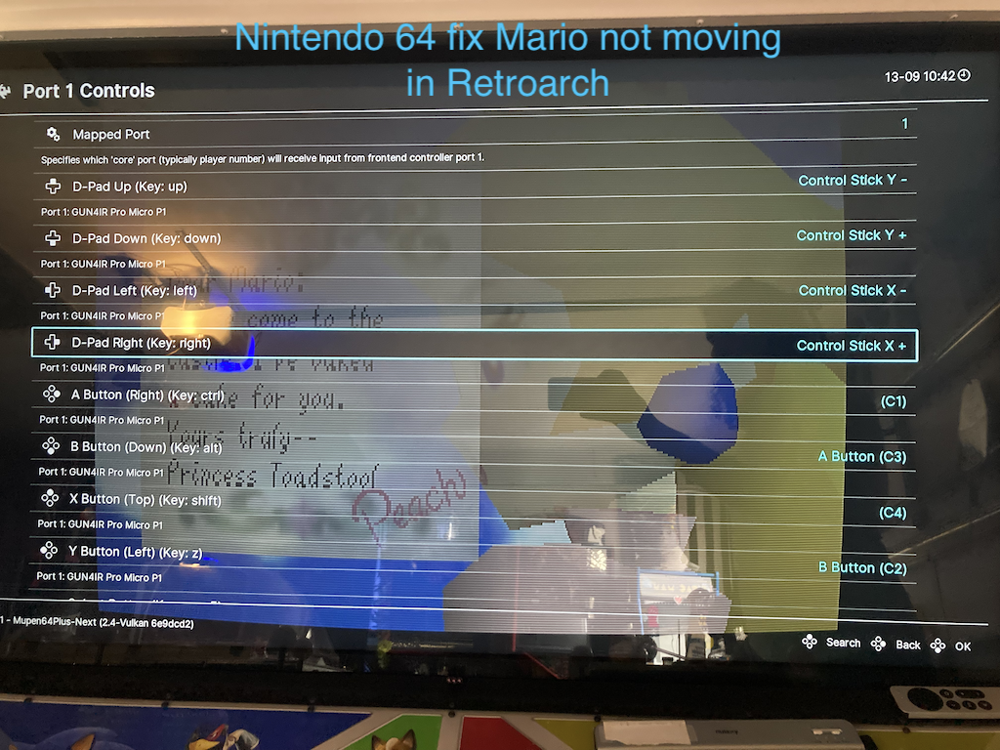

# 🧩 Troubleshooting individual games

**Table of contents**

- [🗡 The Legend of Zelda Links Awakening](#-individual-games)
- [💪 Super Smash Bros](#-individual-games)
- [⛳️ Golden Tee Complete 2006](#-individual-games)
- [🦌 Buck hunter arcade](#-individual-games)
- [⛳️ 2K21 PGA Golf](#-2K21-PGA-Golf)
- [☄️ Dragonball Fighterz](#-dragonball-fighterz)
- [🍄 Mario 64](#-mario-64)
- [🧟‍♀️ House of the Dead remake](#-🧟‍♀️-house-of-the-dead-remake)
- [🟡 Baby PAC-man](#-baby-pac-man)
- [🤠 Wild West Shootout](#-wild-west-shootout)
- [⠷ Tetris Worlds](#-tetris-worlds)

Some games do not come on EHA Omega drive or some are outdated. Here are some Acker Apple must haves.

- [🗡 The Legend of Zelda Links Awakening](https://roms2.cdnrobot.xyz/Tha/The-Legend-of-Zelda-Links-Awakening-NSP-ROMSLAB.rar?download_token=5bc8a10c305ba8cd6ae88acdc166ba089393f021c573239c42082f2aa45a9f46) for Nintendo Switch
- [💪 Super Smash Bros](https://nxbrew.com/super-smash-bros-ultimate-switch-nsp-update/)
- 🎱 Pool nation is one of the best trackball pool games
  - In order to share the trackball, before selecting Player 2's character, press escape and now player two change appearance to indicate shared trackball/mouse
  - [more here](https://steamcommunity.com/sharedfiles/filedetails/?id=187242390)
- ⛳️ Golden Tee Complete 2006 is the latest golf in game that series, that does not require internet connection
  - PGA 2k21 is a great modern alternative that does not require internet
  - 📺 Two YouTube videos exist about getting new Golden Tee working
  - https://www.youtube.com/watch?v=9yEuSIpGc4Q
  - https://www.youtube.com/watch?v=VBP0wVxuuAM
- 🦌 Buck hunter arcade, aka Big Buck Hunter HD, only works 1 player
  - It so looks like player 2 will work but gun won't fire during gameplay
  - Feel lucky, most Megacades don't even work 1 player before 2022
  - Omega drive allows 1 Player as it comes with a game patch
  - [more info and patches here](https://sindenlightgun.miraheze.org/wiki/Big_Buck_Hunter_Arcade)

#### ⛳️ 2K21 PGA Golf

**If mouse will not click menu items**

This game appears to disable the mouse when a gamepad/controller is dedicated as present

- The **quickiest fix** appears to be to unplug other gamepads
  - Unplug devices that register as or similar to "HID-compliant game controller"
  - The game seems to give dedicated priority to gamepads over top of mouse devices
- For GUN4IR owners, if unplugging guns works, then try the following longterm solution:
  - 👀 This solution disables only GUN4IR as a gamepad but keeps it running as a mouse/keyboard
  - Goto "Devices and Printers"
    - Control Panel > Hardware and Sound "View devices and printers"
  - Look for "Devices" top section where you should see atleast "GUN4IR Pro Micro P1"
  - Perform the following on all GUN4IR devices
    - right click > properties
    - goto hardware tab
    - In "Device Functions:" area regular click on "HID-compliant game controller" to highlight
    - click "Properties"
    - click "Disable Device"
    - Done. The GUN4IR will still work as a mouse/keyboard but no longer as a gamepad

Resources: [steamcommunity-issue-1](https://steamcommunity.com/app/1016120/discussions/0/3164316851906198915/) [steamcommunity-issue-2](https://steamcommunity.com/app/695290/discussions/0/1741102632991355043/)

#### ☄️ Dragonball FighterZ

**🪟 If game opens in small window**

Use the in game main menu but make sure you then navigate into the game to have the settings saved.

The in game options menu does in fact work, however if you just exit game immediately, it does not save. I had to edit the options, go one step in the game, I then set the graphic options again on the map area options menu, and then I backed out of the game (not a hard exit). And now the setting seems to go full screen on open!

**🕹 If game buttons used to work but now it seems arcade console buttons have stopped working**

- You can only get past the "press any button" screen with a Player one button
- If XArcade XInput is being used, it maybe conflicting with another controller that has gained priority
  - See the section [🕹 XArcade XInput no player one](-xarcade-xinput-no-player-one)

#### 🍄 Mario 64

Using the emulator Retroarch seems to work best.

If in Retroarch you cannot move Mario but the action buttons work. This is most likely due to your joystick being mapped to direction buttons but needs to be remapped to analog directions. Use the steps below (screen capture below):
1. In game use F1 key on keyboard
  - some keyboards require holding an Fn key to activate the F1 key
2. A menu should have come up
  - Expect that you can navigate it
3. Goto Quick Menu (you may already be on it)
4. Goto Controls
5. Goto Port 1 controls
6. Remap the D-Pad
  - up = Control Stick Y -
  - down = Control Stick Y +
  - left =  = Control Stick X -
  - right =  = Control Stick X +
7. Go back and Save configuration
8. Press F1 to exit the menu
  - Mario should now move around

### 🧟‍♀️ House of the Dead remake

If no guns or if two player does not work, perform the following:

Once you install HOTD Remake for your PC, download the following patch files and copy them into the root of game folder and then press F1 to setup your light guns. That's it! 

[download the patch here](https://drive.google.com/file/d/14-IuuFHCZj5t83AfX7LJoAS8DBVHn7sX/view)

[📺 YouTube video related to patch](https://www.youtube.com/watch?v=UD_w0S_955o)

🟡 Baby PAC-man

EHA Megacade comes with a Baby PAC-man. However, it is/was v1.1 and has issues including no two player button. The latest, as of 8-30-2022, is now v1.5 and has plenty of fixes and a two player button. Baby PAC-man is a pretty rare machine with both a ROM game and physical pinball, making it a bit more complicated to emulate. Follow these steps below:

- [download link](https://vpuniverse.com/files/file/6134-vr-room-baby-pacman-bally-1982/)
  - requires signup/signin
  - download page has multiple downloads, choose the latest
- In VPX Preferences -> Configure Keys, Nudge and DOF
  - ☐ make sure "Disable B2S" is unchecked
  - ☑ "Capture External DMD" is checked
  - ☑ "Capture Backglass/PUI" is checked (optional options)
    - not all version have this nor need it
    - v7 visual pinball confirmed working
- In game, press the "F1" key
  - ☑ Make sure "Show DMD/Display window" is checked
  - ☑ "Use External DMD" is unchecked
  - Restart table
- Now, a stand alone maze screen should be displaying somewhere
  - Find it, and drag it to a place of your choosing
  - You can resize by right-click on it and add border then resize and remove border
- 😡 If the stand alone maze screen keeps being put in background and not viewable
  - Drag the maze to another screen
  - EHA owners, a monitor assist app is docked in the bottom right corner of screen
    - Go into the app
    - Find the option to add a quick key to move your mouse to another screen
    - Start to drag the DMD screen and then use the hot key
      - separate display should now have your Baby PAC-man maze on it

Keywords: baby pac man visual pinball issues help two player button dmd maze screen

🤠 Wild West Shootout

Several issues I experienced with my machine:

1. To get both light guns working I had to following another online wiki
    - [github wiki by argonlefou](https://github.com/argonlefou/DemulShooter/wiki/Coastal#wild-west-shoutout)
2. When I used the above Demulshooter app, I ended up getting a 4:3 aspect ration and fun fired higher than I was aiming.
    - The tip to edit the Windows registry, did not work for me
    - Open the WWS game using DemulShooter script and black bars should **still** be there
    - Then open `Borderless Gaming` (it opens into task bar) and on its left menu select WWS and tap the on screen **right arrow** icon
    - WWS may now already be in a fixed state and if not then on the right sided menu area, find “Cowboy” and edit it’s options to refine and perfect.
    - Ensure Borderless Gaming is set to startup with Windows so game always opens correctly

Keywords: argonlefou DemulShooter cowboy wws gun4ir

⠷ Tetris Worlds

GOAL: 4 Player Tetris

**SYMPTOMS**:

1. Having button conflict with 🐬 Dolphin GameCube Tetris Worlds. Really want to play 4 player. However, pushing the right direction on players 2 and 3 cause player 1 down to activate.
2. It seems Tetris Worlds is running in a different Dolphin then some of the others, not 100% sure. I tried running the game with xarcade involved and I can even map the buttons however when game launches it ignores all my efforts.

**Knowledge**: The Dolphin that loads Tetris Worlds, by default, has player 1 buttons on other controllers. I think this is so something complex with many buttons, like Zelda, can be played from the button console. However because of this player 1 shares buttons with other players.

✅ **FIX**:

To fix. Open the Dolphin app specific to Tetris Worlds. At the very top you will see "Player 1 Standard Controller" with a configure button, tap on it. Review the player 1 buttons. I used middle mouse click to remove many overlapping buttons. Close and you are all set
Reply6m
