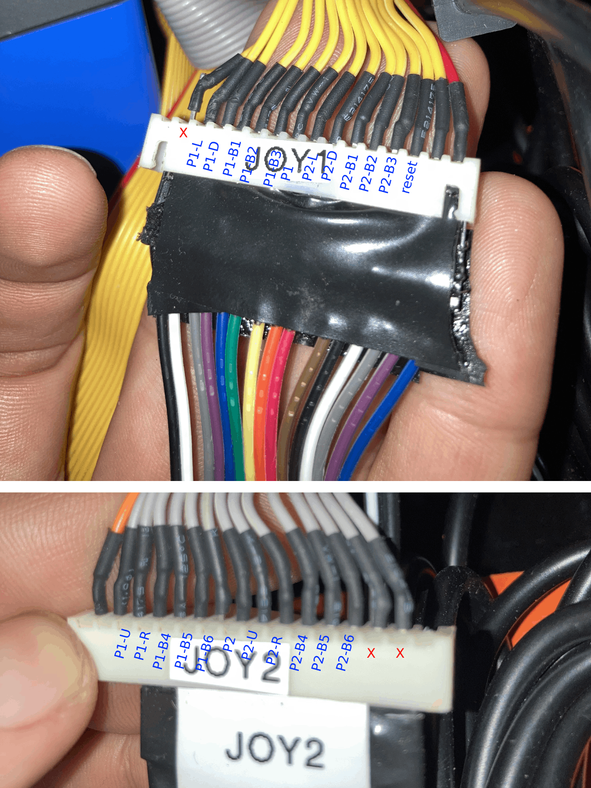

# 🕹 MIDWAY Big Electronics

## Wire mappings

**Yellow Cable**
| Wire | Label | Joystick Label | Alias |
| --- | --- | --- | --- |
| 1   | N/A | N/A | red wire |
| 2   | ⚡️ Power | N/A | |
| 3   | ⬅️ P1-Left | J1 AL | |
| 4   | ⬇️ P1-Down | J1 AD | |
| 5   | P1-B1 | J1 K3 | north |
| 6   | P1-B2 | J1 K4 | east |
| 7   | P1-B3 | J1 L1 | |
| 8   | 👤 P1 Start | J1 ST | K10 |
| 9   | ⬅️ P2-Left | J1 AL | |
| 10  | ⬇️ P2-Down | J2 AD | |
| 11  | P2-B1 | J2 K3 | north |
| 12  | P2-B2 | J2 K4 | east |
| 13  | P2-B3 | J2 L1 | |
| 14  | 🔄 RESET | J1 SE/K9 | SELECT |
| 15  | N/A | | |
| 16  | Positive | | |

**Grey Cable**
| Wire | Label | Joystick Label | Alias |
| --- | --- | --- | --- |
| 1   | N/A |  | red wire |
| 2   | ⚡️ POWER |  | |
| 3   | ⬆️ P1-U | J1 AU | |
| 4   | ➡️ P1-R | J1 AR | |
| 5   | P1-B4 | J1 K1 | west |
| 6   | P1-B5 | J1 K2 | south |
| 7   | P1-B6 | J1 R1 | |
| 8   | 👥 P2 | J2 ST | K9 |
| 9   | ⬆️ P2-U | J2 AU | |
| 10  | ➡️ P2-R | J2 AR | |
| 11  | P2-B4 | J2 K1 | west |
| 12  | P2-B5 | J2 K2 | south |
| 13  | P2-B6 | J2 R1 | |
| 14  | N/A | | |
| 15  | N/A | | |
| 16  | N/A | | |

