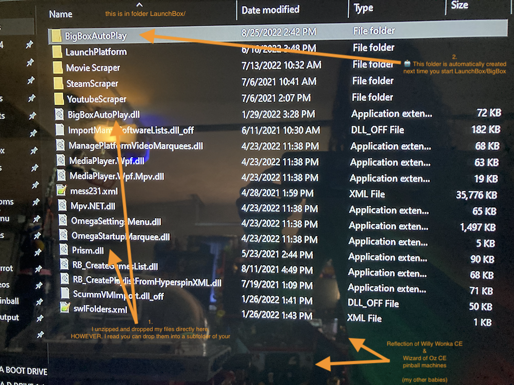
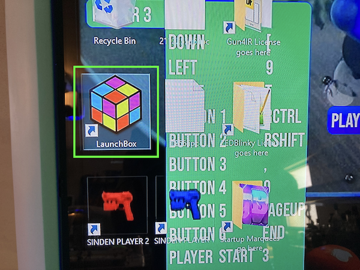
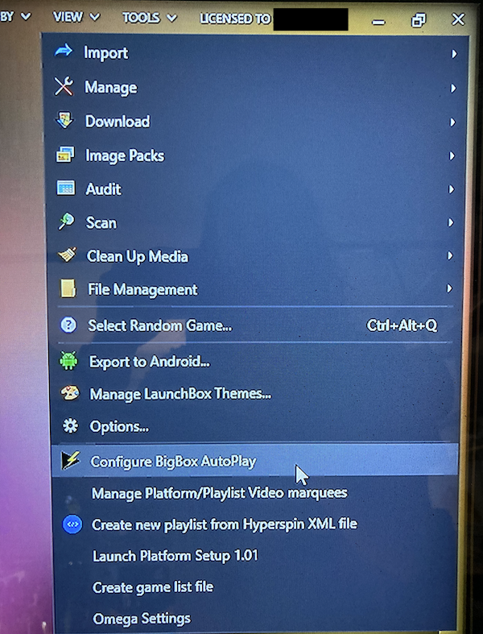
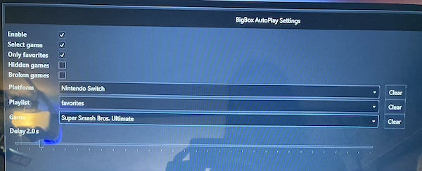
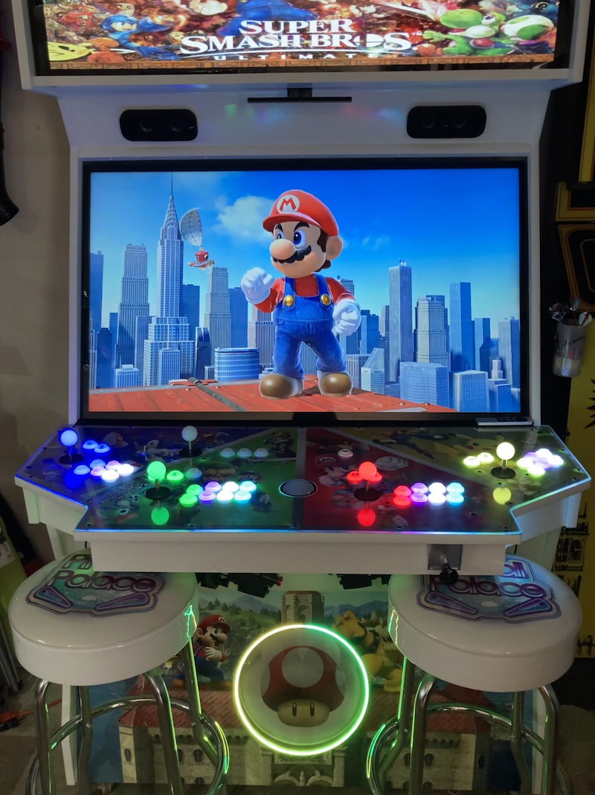
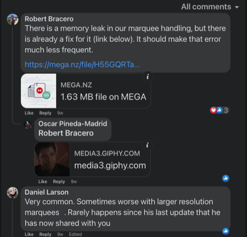
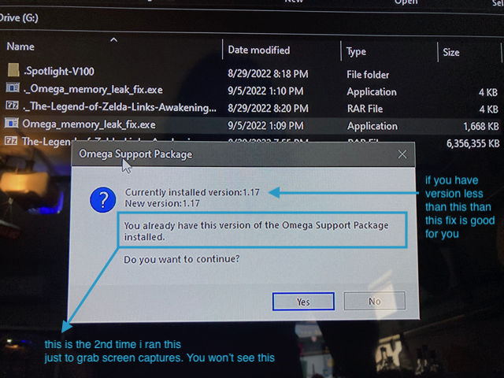
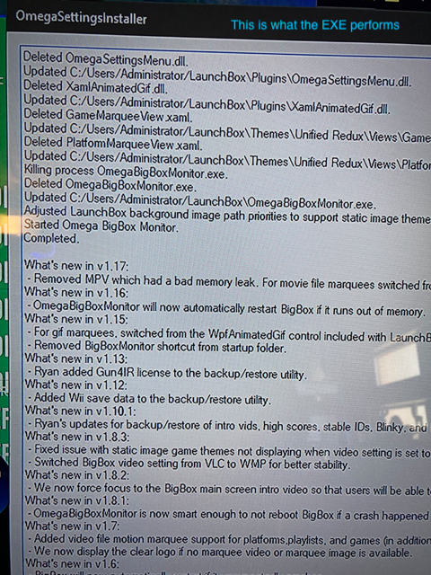

# 🕹 megacade
Things learned and things to remember for my Megacade

👀 Documentation intended for Megacade with Omega drive built after 2021

**Table of contents**
- [👀 First time needs to know](#-first-time-needs-to-know)
- [🎲 Individual games](#-individual-games)
- [🕹 How to map buttons](#-how-to-map-buttons)
  - [Mame arcade button mappings](#mame-arcade-button-mappings)
  - [⚪️ Trackball mapping](#-trackball-mapping)
- [👾 Emulator apps](#-emulator-apps)
- [✅ Fixed issues](-fixed-issues)
  - [🕹 Diagonals not working](#-diagonals-not-working)
  - [🦜 TeknoParrot fails to open game](#-teknoparrot-fails-to-open-game)
  - [🔀 Change default emulator used](#-change-default-emulator-used)
  - [⠇ Menus and side effect during game play](#-menus-and-side-effect-during-game-play)
  - [🏃 Game plays too fast](#-game-plays-too-fast)
  - [☄️ Dragonball z opens in small window](#-dragonball-z-opens-in-small-window)
  - [Atari 5200 blue screen](#atari-5200-blue-screen)
  - [🧠 Fix attract mode out of memory issue](#-fix-attract-mode-out-of-memory-issue)
  - [💡 Fix skipped lights during attract mode](#-fix-skipped-lights-during-attract-mode)
- [💥 LaunchBox to startup into a specific game](#-launchbox-to-startup-into-a-specific-game)
- [🎯 Issues chasing to fix](#-issues-chasing-to-fix)
- [⚡️ Issues with answers to perform](#-issues-with-answers-to-perform)
- [🧩 Certain games](#-certain-games)

## 👀 First time needs to know

- ⚡️ The power "switch" is an arcade button. I was expecting a toggle switch, I've never seen an arcade button act as a power switch but there you go.
  - Hold down power button to force a shutdown when machine is unresponsive
- I had an exit button added, it works most everywhere but not everywhere
  - Be prepared to use trackball and left mouse button to exit those games
  - Or grab a keyboard
- ⌨️ 🐭 ❌ Avoid plugging in a keyboard with a trackpad/mouse
  - Can cause trackball games to confuse which device to use
- My lower cabinet ring light was only one color (not change colors)
  - 🪫 The remote was not working. The battery in remote was dead on arrival
    - 🔋 I was able to replace with 2032 watch battery I had on hand
  - Ring light remote could change to dance mode but it always went back to solid color
    - ✅ I just needed to hold the lock button down for about 5 seconds to lock it in
- 💡 Do you have LEDBlinky controlled lights?
  - 💡 🕹 Do you have light up joysticks and they don't light up in games?
    - The joysticks may not be mapped to light up during game play
  - Use the LEDBlinky apps on the desktop. One app is to assign lights to joystick
    - Its a little complex at first but manageable
    - [🔗 📺 Direct timeline link](https://www.youtube.com/watch?v=29QG7Bd9mKw) to in-depth LEDBlinky controller app tutorial
- 🥷 Mortal Kombat 11 buttons were not working
  - I was told to turn off the Wii bar sensor and that fixed my issue
  - We only turn Wii bar on for Wii games now
- 🔫 Have Gun4Ir?
  - Check IR sensors on left and right of Tv screen for damage
    - Space is so small that they get damaged
    - Mine was broke. Called EHA and was sent, free of charge, replacement
  - The Gun4ir application was on the Windows start menu
    - Use it to test, config, and then "upload settings" with every change
    - Recommend moving icon to more convenient location like desktop
    - Recommend opening this app and not trust that the settings were done yet. The auto "detect" button seems to work well
- 🔓 The BigBox main menu "unlock" code was `1111` for my machine
- How to pair/add old Wii remotes I've always had
  - The Wii sensor bar has a pair button
  - The Wii remotes have a pair button behind the battery flap
- 💡 If you have lighted buttons, they do a good job of lighting by default but typically you will want to learn how to set the lighting by platform if not by some games
  - The lighting apps are fairly easily to navigate and are on the desktop
- 🕹 Many is not most games required controller mapping
  - See where I have learned how to map things [below](#-how-to-map-buttons)

## 🎲 Individual games

- 🎱 Pool nation is on of the best trackball pool games
  - In order to share the trackball, before selecting Player 2 character press escape and now player two will share trackball
  - [more here](https://steamcommunity.com/sharedfiles/filedetails/?id=187242390)
- ⛳️ Golden Tee Complete 2006 is the latest golf in game that series, that the machine comes with
  - 📺 Two YouTube videos exist about getting new golf on
  - https://www.youtube.com/watch?v=9yEuSIpGc4Q
  - https://www.youtube.com/watch?v=VBP0wVxuuAM
- 🦌 Buck hunter arcade, aka Big Buck Hunter HD, only works 1 player
  - It so looks like player 2 will work but gun won't fire during gameplay
  - Feel lucky, most Megacades don't even work 1 player before 2022
  - Omega drive allows 1 Player as it comes with a game patch

## 🕹 How to map buttons

For instance, Nintendo Switch Super Smash Brothers Ultimate only worked from the game controllers but I wanted to map to Megacade joystick/button console.

1. 👉 Goto the game needing mapping in LaunchBox/BigBox
2. 🪙 Press the Player 1 coin button
3. 🧾 A dedicated menu for the game itself should be presented
  - 🍀 If lucky, the second menu item is typically a configure menu item
  - 👾 Second option, is the emulator maybe listed there and using it often takes you to emulator to perform configurations
  - 🔦 You may have to figure out on your own where the emulator is within the operating system and open it manually
    - a list of known [👾 Emulator apps is here](#-emulator-apps) to help you figure out what to open

### Mame arcade button mappings
- While in the game, press player 1 + joystick right

### ⚪️ Trackball mapping

These steps are also helpful when your trackball stops working

- [📺 YouTube video direct timeline link](https://youtu.be/sLVBmAuJigY?t=346) to Mame mappings for Trackball
- While in the game, press player 1 + joystick right
- 👉 Goto input settings
- 🔦 Find Track X and Track Y and set them one at a time
- For Track X, roll trackball left and then right only
- For Track Y, roll trackball up and then down only
- Close menus, should be good to go
- HIGHLY recommended to run USB wire of trackball directly into computer

## 👾 Emulator apps

Sometimes Big Box doesn't launch the emulator when asked (Flip Box) or it doesn't list the emulater. Here are a few of the apps that allow you to configure the inputs

| System | Emulator Name |
|--- | --- |
| 🟥 Nintendo Switch | yuzu |
| 💠 PlayStation 3 | PCS3 |
| 🔴 Dreamcast | redream |

# ✅ Fixed issues

## 🕹 Diagonals not working

If your players are not allowing Diagonals, open the panel and move the restrictor plates (round dials that turn with 4 spring loaded screws). They are normally all set to 8-way for the 4 players normal joysticks but they may be turned to 4-way for some reason.

[j-stick-ball-top](https://www.ultimarc.com/arcade-controls/joysticks/j-stik-ball-top/)

### 🦜 TeknoParrot fails to open game

Most likely the issue is that your Visuall C++ needs updating

1. Download the microsoft [zip file here](https://www.techpowerup.com/download/visual-c-redistributable-runtime-package-all-in-one/)
2. Unzip the downloaded file somewhere onto your arcade machine
3. To install, run the included install-all.bat with admin privileges
    - right click, "Run as administrator"
4. Restart and enjoy

### 🔀 Change default emulator used

CASE: The default Nintendo 64 emulator does not show any side bezel art. If you just switch the default emulator then every N64 game will look better when opened

> 4 screen captures of this process below

1. Open Launchbox app (not the BigBox main app)
2. Goto 🛠 tools > manage emulators > retroarch > cores
3. Set what you want as default
  - Be very careful. You can break many systems messing around in there.

[Step1.jpeg](assets/images/default-emulator/Step1.jpeg)
[Step2.jpeg](assets/images/default-emulator/Step2.jpeg)
[Step3.jpeg](assets/images/default-emulator/Step3.jpeg)
[Step4.jpeg](assets/images/default-emulator/Step4.jpeg)

### ⠇ Menus and side effect during game play

Most emulators have hotkeys. To fix odd menus and action from occurring, change or turn off hot keys in the appropriate emulator's application settings.

### 🏃 Game plays too fast

1. Goto Nvidia Control Panel app
2. Manage 3D settings
3. Program settins tab
4. Add the exe or whatever opens the game
    - If you recently opened, just use the "Recently used" category and find application
5. then Max Frame Rate, typically to 60
    - I could not type in the field, I choose 58 as only value I could scroll to
6. Reopen app, you should be all set

> Above keywords: speed pace twice too fast framerate nvidia aliens batman tecnoparrot ui

### ☄️ Dragonball Z opens in small window

Use the in game main menu but make sure you then navigate into the game to have the settings saved.

The in game options menu does in fact work, however if you just exit game immediately, it does not save. I had to edit the options, go one step in the game, I then set the graphic options again on the map area options menu, and then I backed out of the game (not a hard exit). And now the setting seems to go full screen on open!

### Atari 5200 blue screen

It possible LaunchBox is using the wrong core.

1. Go into Launchbox, click the menu on the top left, tools, manage, emulators.
2. In there click on retroarch and then the edit button on the bottom of the screen 
3. Then on the left side click on associated platforms.
4. Find Atari 5200 and change the core from atari800_libretro to a5200_libretro
5. Click the OK button at the bottom and you should be good

### 💥 LaunchBox to startup into a specific game

Use cases:
- At my house, guests can turn on Megacade and get right into a game without learning menus
- You want the art package on megacade to match power on game
- You want the startup process to have a few workflows
  - You want the matching marquee to show to show with startup game
  - You have light up buttons and/or joysticks and want them to match the startup game
  - exiting game goes back into Launchbox

This process revolves around using a super great [Launchbox plugin](https://forums.launchbox-app.com/files/file/3267-big-box-auto-play/)

**Steps**
1. [Goto the autostart plugin download page](https://forums.launchbox-app.com/files/file/3267-big-box-auto-play/)
    - launchbox-app.com requires signup or signin to download
    - If you don't easily see a download button, you are not signed in
    - Signup is painless
    - If in the far future you cannot get the file, try [filing an issue here](https://github.com/AckerApple/megacade/issues) and maybe I can help
2. Download the autostart plugin
3. Unzip the autostart plugin into `LaunchBox/Plugins`
    - 
4. Open LaunchBox, NOT the one that launch on startup
    - I've never opened this launchbox app until adding this pluging so attaching screen cap
    - 
5. Goto the tools menu in LaunchBox
    - 
6. Set your settings into the autostart
    - ☑️ Be sure to check the box "Select Game" otherwise video marquee may not come on
    - 
7. Restart machine or just your main BigBox... Whatever you do, Enjoy!
    - 

## 🧠 Fix attract mode out of memory issue

In early versions of Omega, if you left LaunchBox idle/untouched in attract mode for great than about 5 hours, an out of memory issue would occur.

> Your system is running out of memory (RAM) and LaunchBox cannot continue.

The fix is easy, I have left me machine on overnight to test. An patching exe file can be downloaded and it repairs the issue.

- 💾 [original patch file download](https://mega.nz/file/H55GQRTa#mqUN6TjAZONtbBgEFiNEiq2y9Aj3iZvHC9XYhKaughg) provided by Robert Bracero
  - ⏳ 💾 [backup of file stored here on github](assets/images/attract-memory-issue/Omega_memory_leak_fix.exe) provided by Acker Apple

Original found comment of patch file

See screen captures of the process below

## 💡 Fix skipped lights during attract mode

When Megacade has lighted buttons/joysticks controlled by LEDBlinky and it sits untouched for a short time, it goes into an attract mode where the lighting "dances". If during this attract mode some lights are not lighting, such as my machine an entire joystick was not lighting, perform the following steps:

> 👀 The solution below is for when you know the lights are working, they just don't work during attract mode

1. Exit to Windows
2. Find the LEDBlinky app `LEDBlinkyAnimationEditor.exe`
  - On my machine, the app was in a Desktop folder shortcut labeled `LEDBlinky License goes here`
  - App should open with a main display that has a visual map of your buttons
3. To start fixing your attract mode animation, tap the "Animation" menu at top
4. Tap `Open...`
  - Hopefully the folder menu is targeted at a folder labeled "lwa"
  - Should be a path like `Administrator\LaunchBox\Tools\LEDBlinky\lwa`
5. If you are just trying to fix your attract mode lighting, open the file `zippy.lwax`
  - It's possible your attract animation is a different file
  - When you have opened the file, you can see what lights and also you can play the animation by find the ⏯ play/stop icon towards bottom left
6. Once you have confirmed you have the right animation file, edit the frames to add in your skipped light
  - You can navigate frame by frame, you can add frames
7. Save when complete and get back into big box and test your attract mode lighting, should be working now

## 🎯 Issues chasing to fix

- Cannot play xBox games on the Megacade console joysticks/buttons
  - xEmu application allows me to set inputs to keyboard but I cannot remap the keys
  - I can only set one player to the keyboard. Keyboard cannot be shared across players
- 📺 I had a HDMI 2 with audio splitter, lets call it, added so I could connect additional devices and play audio through main speakers. It works but at half volume on any device I try. I have reviewed every LG tv setting on Tv and on every device. I cannot achieve high volume through megacade speakers from additional device
- 🎬 ❌ None of the items in "Movies" will play
  - The unite group gave me a reply: `Because there were no movies on Omega when given to Dave. Dave has since put them back on, but that’s on him to guide you. Give him a call.`
  - Contacted Dave and he mentioned a new drive coming out with more games and movies. May just wait for that. Hate to have broken movies folder. Will give this issue some more time.

## ⚡️ Issues with answers to perform

- ⛳️ The trackball/golf games keep forgetting my trackball time after time of reinputing it
  - `get your Motherboard drivers installed. Don't trust that EHA did that. Also run a direct USB cable from the trackball to the computer and bypass any hub. I had the same problem for years until I installed the MB drivers. Also, don't get an external keyboard with a touchpad. That can jack things up. If you do all of that it will be pretty solid until you unplug something. But it's going to be far more solid after you do all of the above`
- 💾 How do I save and load states to pick a game right back up?  
  - `For the emulators I’ve played (NES, SNES, TG-16, Genesis, Sega CD) F1 in game brings up the menu which includes save/load states`

### 🧩 Certain games

Some games do not come on EHA Omega drive or some are outdated. Here are some Acker Apple must haves.

- [🗡 The Legend of Zelda Links Awakening](https://roms2.cdnrobot.xyz/Tha/The-Legend-of-Zelda-Links-Awakening-NSP-ROMSLAB.rar?download_token=5bc8a10c305ba8cd6ae88acdc166ba089393f021c573239c42082f2aa45a9f46) for Nintendo Switch
- [💪 Super Smash Bros](https://nxbrew.com/super-smash-bros-ultimate-switch-nsp-update/)

🧟‍♀️ House of the Dead remake

If no guns or if two player does not work, perform the following:

Once you install HOTD Remake for your PC, download the following patch files and copy them into the root of game folder and then press F1 to setup your light guns. That's it! 

[download the patch here](https://drive.google.com/file/d/14-IuuFHCZj5t83AfX7LJoAS8DBVHn7sX/view)

[📺 YouTube video related to patch](https://www.youtube.com/watch?v=UD_w0S_955o)

🟡 Baby PAC-man

EHA Megacade comes with a Baby PAC-man. However, it is/was v1.1 and has issues including no two player button. The latest, as of 8-30-2022, is now v1.5 and has plenty of fixes and a two player button. Baby PAC-man is a pretty rare machine with both a ROM game and physical pinball, making it a bit more complicated to emulate. Follow these steps below:

- [download link](https://vpuniverse.com/files/file/6134-vr-room-baby-pacman-bally-1982/)
  - requires signup/signin
  - download page has multiple downloads, choose the latest
- In VPX Preferences -> Configure Keys, Nudge and DOF
  - ☐ make sure "Disable B2S" is unchecked
  - ☑ "Capture External DMD" is checked
  - ☑ "Capture Backglass/PUI" is checked (optional options)
    - not all version have this nor need it
    - v7 visual pinball confirmed working
- In game, press the "F1" key
  - ☑ Make sure "Show DMD/Display window" is checked
  - ☑ "Use External DMD" is unchecked
  - Restart table
- Now, a stand alone maze screen should be displaying somewhere
  - Find it, and drag it to a place of your choosing
  - You can resize by right-click on it and add border then resize and remove border
- 😡 If the stand alone maze screen keeps being put in background and not viewable
  - Drag the maze to another screen
  - EHA owners, a monitor assist app is docked in the bottom right corner of screen
    - Go into the app
    - Find the option to add a quick key to move your mouse to another screen
    - Start to drag the DMD screen and then use the hot key
      - separate display should now have your Baby PAC-man maze on it

Keywords: baby pac man visual pinball issues help two player button dmd maze screen
