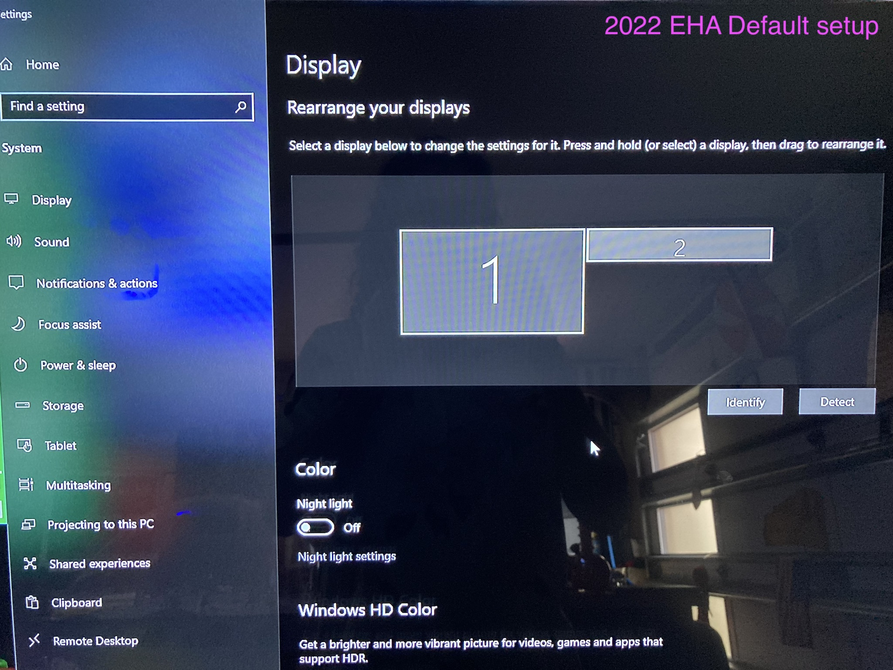
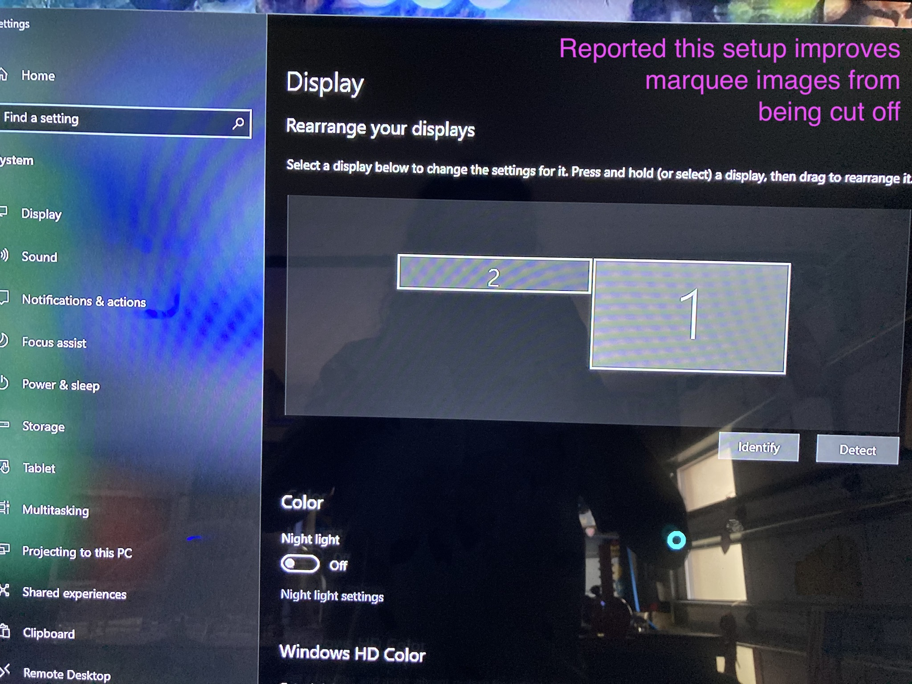

# 🕹 mega-aide
Things learned and things to remember for my Megacade

👀 Documentation intended for Megacade with Omega drive built after 2021

**Table of contents**
- [👀 First time needs to know](#-first-time-needs-to-know)
- [✅ Fixed issues](./FIXED-ISSUES.md)
- [🕹 How to map buttons](#-how-to-map-buttons)
  - [Mame arcade button mappings](#mame-arcade-button-mappings)
  - [⚪️ Trackball mapping](#-trackball-mapping)
- [👾 Emulator apps](#-emulator-apps)
- [🎯 Issues chasing to fix](#-issues-chasing-to-fix)
- [⚡️ Issues with answers to perform](#-issues-with-answers-to-perform)
- [🤖 Individual Emulators](#-individual-emulators)
  - [Yuzu](#yuzu)
- [🧩 Individual games](./GAMES.md)
- [💪 Enhancements](./ENHANCEMENTS.md)

## 👀 First time needs to know

- ⚡️ The power "switch" is an arcade button. I was expecting a toggle switch, I've never seen an arcade button act as a power switch but there you go.
  - Hold down power button to force a shutdown when machine is unresponsive
- I had an exit button added, it works most everywhere but not everywhere
  - Be prepared to use trackball and left mouse button to exit those games
  - Or grab a keyboard
- ⌨️ 🐭 ❌ Avoid plugging in a keyboard with a trackpad/mouse
  - Can cause older trackball games to confuse which device to use
- My lower cabinet ring light was only one color (not change colors)
  - 🪫 The remote was not working. The battery in remote was dead on arrival
    - 🔋 I was able to replace with 2032 watch battery I had on hand
  - Ring light remote could change to dance mode but it always went back to solid color
    - ✅ I just needed to hold the lock button down for about 5 seconds to lock it in
- 🥷 Mortal Kombat 11 buttons were not working
  - I was told to turn off the Wii bar sensor and that fixed my issue
  - We only turn Wii bar on for Wii games now
- 🔓 The BigBox main menu "unlock" code was `1111` for my machine
- How to pair/add old Wii remotes I've always had
  - The Wii sensor bar has a pair button
  - The Wii remotes have a pair button behind the battery flap

### 🖥 Monitors first time knowledge

Like most any computer with multiple monitors, the operating system will have multiple monitor support software. In addition, EHA machines, typically come with additional multi monitor management software.

EHA machines typically have the [Dual Monitor](https://sourceforge.net/projects/dualmonitortool/) app installed. Largely this tool assists with things like locking mouse cursor to main screen.

⚠️ Be cautious to use or add any hot/quick keys into this app because often the combinations of buttons maybe pressed while playing a game which can result undesirable behavior

Monitor position matters. If you have a marquee monitor, often it comes default with a software setup. However some report an alternate configuration has greater support. 

See the below two images with annotations...

### 🕹 Joystick first time knowledge

It is fairly important to know what a **4 way** and an **8 way** joystick means. Joysticks come with the ability to be either 4 way or 8 way with some sort of toggle.

> If you are able to hit diagonal directions on your joystick, then you most likely have an 8-way gate. 4-way gates are used for different games than 8-way gates. For example, in Pac-Man there is no diagonal movement. Hitting a diagonal when you are trying to turn a corner will only slow you down.
[reddit](https://www.reddit.com/r/fightsticks/comments/d2lqnz/difference_between_a_4way_stick_and_an_8way/)

Did you know? If your player 1 seat has two joysticks it's typically so one joystick acts as a 4 way and the other acts as an 8 way.

**CASE**: Many older arcade games only make use of 4 directions. 8 way joysticks can ruin your experience.

**CASE**: You can't move diagonal in a game. Your joystick should be in an 8 way configuration.

**CASE**: PAC-MAN Battle Royal is a four player game that only has use of 4 axises. Your joystick is best in 4 way mode otherwise you will not always turn when you want

How to change? Most often times, reviewing underneath the arcade button console will be required. Most joysticks that can be 4 or 8 way, have a large circular disk like gear that can be manually rotated to engage on or the other mode.

-  Many if not most games required controller mapping
  - See where I have learned how to map things [below](#-how-to-map-buttons)

### 🔫 Gun4Ir first time knowledge

- Check IR sensors on left and right of Tv screen for damage
  - Space is so small that they get damaged
  - Mine was broke. Called EHA and was sent, free of charge, replacement
- The Gun4ir application was on the Windows start menu
  - Use it to test, config, and then "upload settings" with every change
  - Recommend moving icon to more convenient location like desktop
  - Recommend opening this app and not trust that the settings were done yet
    - The auto "detect" button seems to work well

### 💡 LEDBlinky first time knowledge

- 💡 🕹 Do you have light up joysticks and they don't light up in games?
  - The joysticks may not be mapped to light up during game play
- Use the LEDBlinky apps on the desktop. One app is to assign lights to joystick
  - Its a little complex at first but manageable
  - [🔗 📺 Direct timeline link](https://www.youtube.com/watch?v=29QG7Bd9mKw) to in-depth LEDBlinky controller app tutorial
- The lights typically do a good job of lighting correctly by default with EHA purchase
  - However it's recommended be prepared to learn how to...
    - set the lighting by platform
    - set button lighting by individual game
    - Quick search find a platform or game with no default lighting
  - The lighting apps are fairly easily to navigate and typically links to them are on the EHA machine desktop

## 🕹 How to map buttons

For instance, Nintendo Switch Super Smash Brothers Ultimate only worked from the game controllers but I wanted to map to Megacade joystick/button console.

1. 👉 Goto the game needing mapping in LaunchBox/BigBox
2. 🪙 Press the Player 1 coin button
3. 🧾 A dedicated menu for the game itself should be presented
  - 🍀 If lucky, the second menu item is typically a configure menu item
  - 👾 Second option, is the emulator maybe listed there and using it often takes you to emulator to perform configurations
  - 🔦 You may have to figure out on your own where the emulator is within the operating system and open it manually
    - a list of known [👾 Emulator apps is here](#-emulator-apps) to help you figure out what to open

### Mame arcade button mappings
- While in the game, press player 1 + joystick right

### ⚪️ Trackball mapping

These steps are also helpful when your trackball stops working

- [📺 YouTube video direct timeline link](https://youtu.be/sLVBmAuJigY?t=346) to Mame mappings for Trackball
- While in the game, press player 1 + joystick right
- 👉 Goto input settings
- 🔦 Find Track X and Track Y and set them one at a time
- For Track X, roll trackball left and then right only
- For Track Y, roll trackball up and then down only
- Close menus, should be good to go
- HIGHLY recommended to run USB wire of trackball directly into computer

## 👾 Emulator apps

Sometimes Big Box doesn't launch the emulator when asked (Flip Box) or it doesn't list the emulater. Here are a few of the apps that allow you to configure the inputs

| System | Emulator Name |
|--- | --- |
| 🟥 Nintendo Switch | yuzu |
| 💠 PlayStation 3 | PCS3 |
| 🔴 Dreamcast | redream |

# ✅ Fixed issues

This section has moved to [here](./FIXED-ISSUES.md)

### 🧩 Individual games

This section has moved to [here](./GAMES.md)